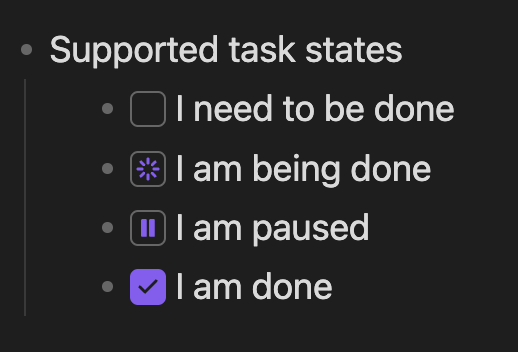

# Task list

A simple obsidian plugin enabling better task management via lists.

# Features

- [x] Create lists with task states

  - Simply start an ordered or unordered list and then add one of the following directives, :to-do, :doing, :paused, :done

  ```md
  - Supported task states
    - :to-do I need to be done
    - :doing I am being done
    - :paused I am paused
    - :done I am done
  ```

  These will render the directives as interactive task state boxes like so

  

- [x] Sort lists according to its status
  - Sorts can be triggered via the "Sort lists" command, the context menu (<kbd>Option</kbd> + click or right click) on a task state box or the context menu on the editor
  - Lists will be sorted according to this sort order
    - :doing First, as your attention is needed
    - :paused Second, as you may need to review it
    - :to-do Third, as you can pick this up when the above is done
    - :done Last, as your attention isn't needed
- [x] Change the states of a task list item
  - Click a task state box to cycle to the next state
  - Use the context menu on a task state box to mark a different state
- [x] Performance focused, a lot of care is taken to ensure task-list doesn't slow down obsidian
- [x] Extends markdown but doesn't break it, your documents will still render outside of this plugin, with a readable task state and easy to remember directives

# Installation

## Build from source

1. Clone this repo to `./vault/.obsidian/plugins`
1. Run `npm run build`
1. Start obsidian
1. Navigate to Settings > Community plugins
1. Enable the "Task list" plugin
